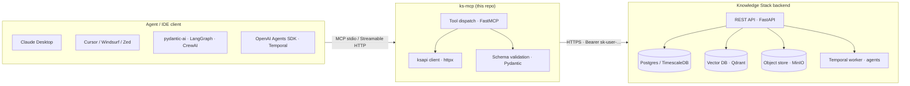
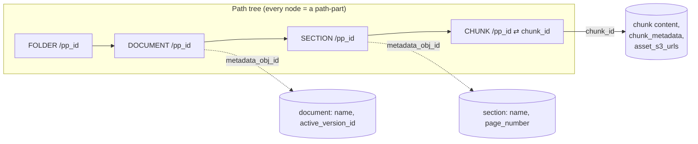
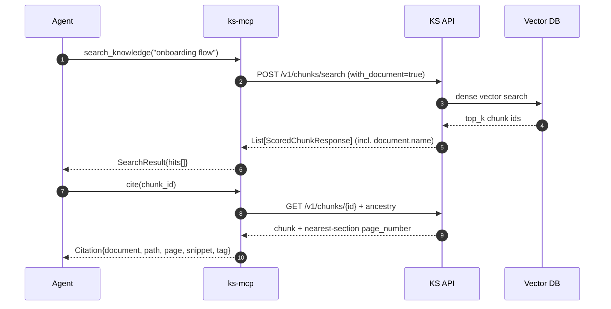
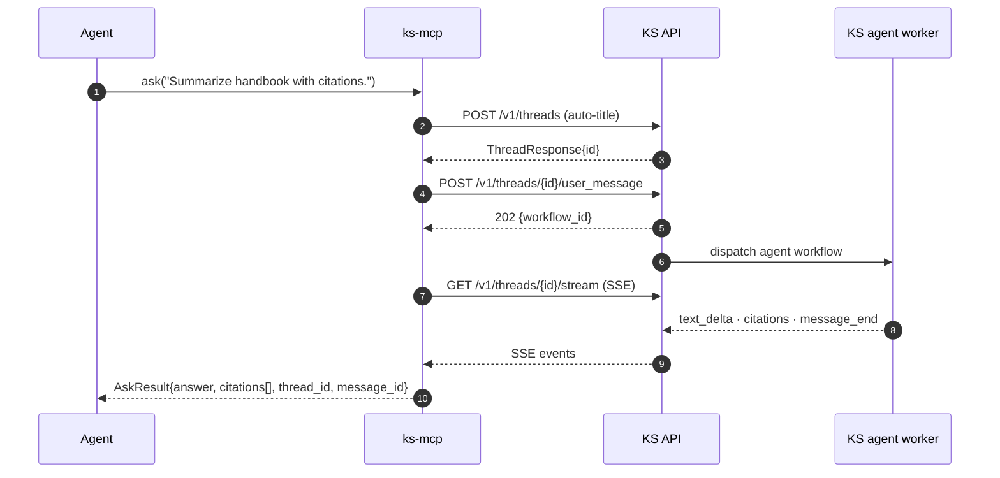

# Architecture

`ks-mcp` is a thin, typed façade over the Knowledge Stack REST API (`ksapi`). No retrieval logic lives in this server — every tool call is translated into one or more typed HTTP calls and projected back into MCP content blocks (text, JSON, image).

## System view



**Key properties:**

- Mostly read-only. Only `ask` mutates (creates a thread + assistant message); everything else is GET-only.
- Tenant-scoped — every call carries a per-user `KS_API_KEY`; tenant isolation is enforced upstream.
- Grounded — every search hit and `read` payload returns stable chunk IDs you can cite.

## Two paths to a grounded answer

```mermaid
flowchart TB
  Q([User question])

  Q --> Quick[ask&#40;question, thread_id?&#41;]
  Quick --> A1[KS agent retrieves + drafts]
  A1 --> SSE[SSE: text_delta · citations · message_end]
  SSE --> Out1([Answer + AskCitation&#91;&#93;])

  Q --> S1{Concept or exact term?}
  S1 -- concept --> Sk[search_knowledge]
  S1 -- exact --> Sw[search_keyword]
  Sk --> Hit[ChunkHit: chunk_id, materialized_path, text]
  Sw --> Hit
  Hit --> Pull{Need more context?}
  Pull -- yes --> RA[read_around&#40;chunk_id&#41;]
  Pull -- yes --> Rd[read&#40;chunk_id|path_part_id&#41;]
  Pull -- yes --> Img[view_chunk_image&#40;chunk_id&#41;]
  RA --> Cite[cite&#40;chunk_id&#41;]
  Rd --> Cite
  Img --> Cite
  Cite --> Out2([Answer + Citation per chunk])
```

- **Quick path (`ask`)** — one tool call. Right when you want a single grounded answer.
- **Custom path** — you orchestrate. Right when the answer needs multiple chunks across documents, when you want to control the prompt, or when you're interleaving retrieval with other tools.

Side tools — `list_contents`, `find`, `get_info` — exist for navigation. `trace_chunk_lineage` and `compare_versions` answer "where did this evidence come from?" once you already have a chunk in hand.

## Identifier model

The two UUIDs you'll see most often look identical but are different objects:



| Field | Comes from | Use it with |
| --- | --- | --- |
| `chunk_id` | `search_*` hits, `[chunk:UUID]` tags, `cite` | `cite`, `read_around`, `view_chunk_image`, `read` (fallback) |
| `path_part_id` | `list_contents`, `find`, `get_info`, search hits | `read`, `get_info`, `list_contents`, search filters |
| `materialized_path` | every chunk / path-part response | display only — **never** as an id |

> When in doubt, pass it to `read` — it accepts either a `path_part_id` or a `chunk_id` and falls back automatically on 404.

## Request lifecycle (custom path)



## `ask` lifecycle (quick path)



`AskResult.thread_id` can be passed back on the next `ask(...)` call for multi-turn follow-ups.

## Source layout

```
src/ks_mcp/
├── server.py         # FastMCP entrypoint + CLI
├── client.py         # ksapi client factory (KS_API_KEY / KS_BASE_URL)
├── schema.py         # pydantic IO models (ChunkHit, Citation, AskResult, …)
├── errors.py         # ksapi.ApiException → McpError
└── tools/
    ├── search.py     # search_knowledge, search_keyword
    ├── read.py       # read, read_around, view_chunk_image
    ├── cite.py       # cite (structured citation builder)
    ├── ask.py        # ask (one-shot agent Q&A over SSE)
    ├── browse.py     # list_contents, find, get_info
    ├── org.py        # get_organization_info, get_current_datetime
    └── provenance.py # trace_chunk_lineage, compare_versions
```
