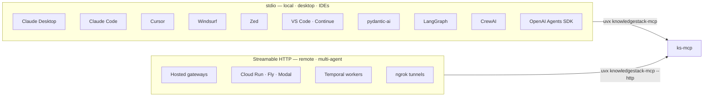

# Client setup

`ks-mcp` works with any client that speaks MCP **stdio** or **Streamable HTTP**. Pick your client below.



> **Common prerequisite:** export `KS_API_KEY="sk-user-…"` before launching, or pass it via the client's `env` block. See [Configuration](Configuration) for every var.

---

## Claude Desktop

`~/Library/Application Support/Claude/claude_desktop_config.json` (macOS)
`%APPDATA%\Claude\claude_desktop_config.json` (Windows)

```json
{
  "mcpServers": {
    "knowledgestack": {
      "command": "uvx",
      "args": ["knowledgestack-mcp"],
      "env": { "KS_API_KEY": "sk-user-..." }
    }
  }
}
```

Restart Claude Desktop and the `knowledgestack` tools appear in the tool palette.

## Claude Code

```bash
claude mcp add knowledgestack -- uvx knowledgestack-mcp
# then export KS_API_KEY in your shell or set it under "env" in
# ~/.claude/settings.json
```

## Cursor

`~/.cursor/mcp.json`:

```json
{
  "mcpServers": {
    "knowledgestack": {
      "command": "uvx",
      "args": ["knowledgestack-mcp"],
      "env": { "KS_API_KEY": "sk-user-..." }
    }
  }
}
```

## Windsurf

`~/.codeium/windsurf/mcp_config.json` (or **Settings → MCP servers**):

```json
{
  "mcpServers": {
    "knowledgestack": {
      "command": "uvx",
      "args": ["knowledgestack-mcp"],
      "env": { "KS_API_KEY": "sk-user-..." }
    }
  }
}
```

## Zed

`~/.config/zed/settings.json`:

```json
{
  "context_servers": {
    "knowledgestack": {
      "command": {
        "path": "uvx",
        "args": ["knowledgestack-mcp"],
        "env": { "KS_API_KEY": "sk-user-..." }
      }
    }
  }
}
```

## VS Code (Continue)

`~/.continue/config.yaml`:

```yaml
mcpServers:
  - name: knowledgestack
    command: uvx
    args: ["knowledgestack-mcp"]
    env:
      KS_API_KEY: "sk-user-..."
```

---

## pydantic-ai

```python
from pydantic_ai import Agent
from pydantic_ai.mcp import MCPServerStdio

ks = MCPServerStdio("uvx", ["knowledgestack-mcp"])
agent = Agent("openai:gpt-4.1", mcp_servers=[ks])

async with agent.run_mcp_servers():
    result = await agent.run("Summarize the onboarding handbook with citations.")
    print(result.output)
```

## LangChain / LangGraph

```python
from langchain_mcp_adapters.client import MultiServerMCPClient

client = MultiServerMCPClient({
    "knowledgestack": {
        "command": "uvx",
        "args": ["knowledgestack-mcp"],
        "transport": "stdio",
    }
})
tools = await client.get_tools()
# bind these tools to your LangGraph agent or LangChain chain.
```

## CrewAI

```python
from crewai_tools import MCPServerAdapter

ks_tools = MCPServerAdapter(
    server_params={"command": "uvx", "args": ["knowledgestack-mcp"]},
).tools
# pass `ks_tools` into your Crew agents.
```

## OpenAI Agents SDK

```python
from agents import Agent
from agents.mcp import MCPServerStdio

server = MCPServerStdio(params={"command": "uvx", "args": ["knowledgestack-mcp"]})
agent = Agent(name="Research", mcp_servers=[server])
```

## Temporal

Run the server over Streamable HTTP and attach from your worker:

```bash
uvx knowledgestack-mcp --http --host 0.0.0.0 --port 8765
```

Then in your Temporal activity:

```python
from anthropic.tools.mcp import MCPClient  # or your framework's client

client = MCPClient.streamable_http("http://ks-mcp.internal:8765")
```

---

## Verification

After wiring up any client, sanity-check by asking the agent:

> *"Use `knowledgestack` to list the root folders and tell me the tenant name."*

You should see calls to `list_contents` and `get_organization_info`. If the client reports "tool not found", restart it after editing config — most clients only reload MCP servers on launch.

For deeper troubleshooting see **[Diagnostics](Diagnostics)**.
