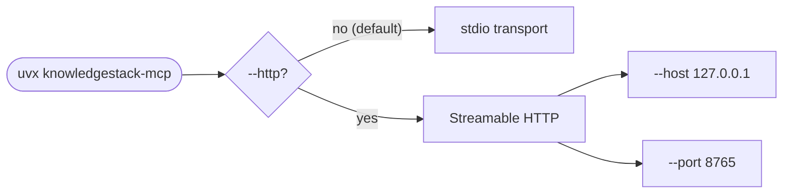
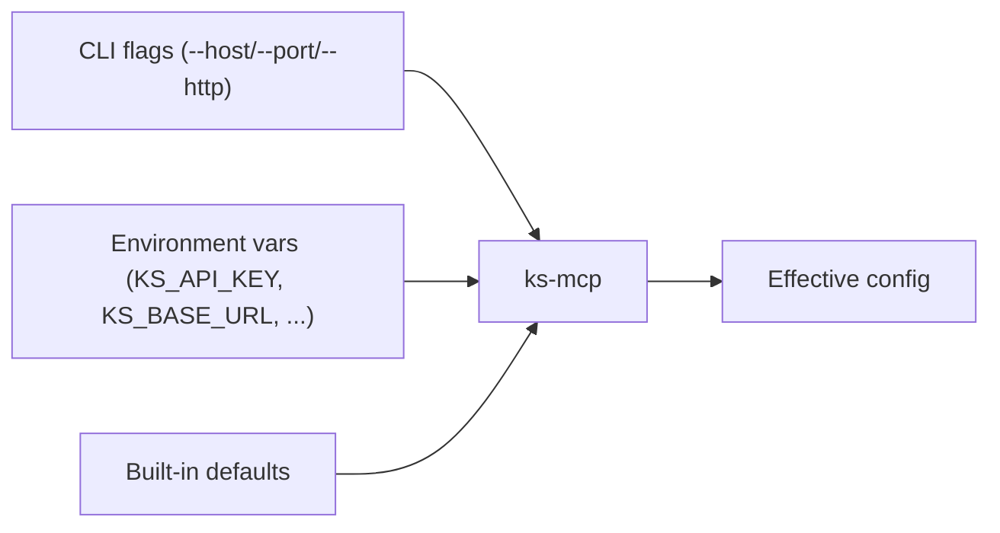

# Configuration

Everything `ks-mcp` reads from the environment or the CLI.

## Environment variables

| Variable | Required | Default | Notes |
| --- | --- | --- | --- |
| `KS_API_KEY` | yes | — | A `sk-user-…` key scoped to a single tenant user. Issue from the KS dashboard. |
| `KS_BASE_URL` | no | `https://api.knowledgestack.ai` | Point at staging or a self-hosted deployment. |
| `KS_TIMEOUT_S` | no | `30` | HTTP timeout for upstream `ksapi` calls. |
| `KS_LOG_LEVEL` | no | `INFO` | `DEBUG` prints tool I/O to **stderr** (never stdout — safe for stdio transport). |

```bash
export KS_API_KEY="sk-user-..."
export KS_BASE_URL="https://api.knowledgestack.ai"   # optional
```

## CLI flags



```text
usage: knowledgestack-mcp [-h] [--http] [--host HOST] [--port PORT]

options:
  -h, --help    show this help message and exit
  --http        Serve over Streamable HTTP instead of stdio.
  --host HOST   default: 127.0.0.1
  --port PORT   default: 8765
```

## Config priority



Anything not on the CLI falls back to the environment, then to the built-in default. There is **no** config file — keep secrets out of git.

## Where to set env vars per client

| Client | Where to set `KS_API_KEY` |
| --- | --- |
| Claude Desktop | `mcpServers.knowledgestack.env` in `claude_desktop_config.json` |
| Cursor | `mcpServers.knowledgestack.env` in `~/.cursor/mcp.json` |
| Windsurf | `mcpServers.knowledgestack.env` in MCP config |
| Zed | `context_servers.knowledgestack.command.env` in `settings.json` |
| VS Code (Continue) | `mcpServers[].env.KS_API_KEY` in `~/.continue/config.yaml` |
| Claude Code | shell export, or `env` in `~/.claude/settings.json` |
| pydantic-ai · LangGraph · CrewAI · OpenAI Agents | the host process's environment |

See [Client setup](https://github.com/knowledgestack/ks-mcp/wiki/Client-Setup) for full snippets per client.

## Tenant scoping

`ks-mcp` does not have its own scoping logic — every request sends the bearer token, and the KS backend enforces tenant isolation. To run multi-tenant from one machine, use **multiple MCP server entries with different `KS_API_KEY`s**:

```json
{
  "mcpServers": {
    "ks-acme": { "command": "uvx", "args": ["knowledgestack-mcp"], "env": { "KS_API_KEY": "sk-user-acme..." } },
    "ks-globex": { "command": "uvx", "args": ["knowledgestack-mcp"], "env": { "KS_API_KEY": "sk-user-globex..." } }
  }
}
```

Each becomes its own tool prefix in the agent's tool palette.
