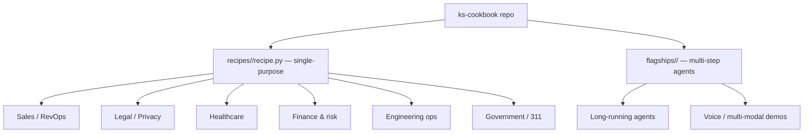
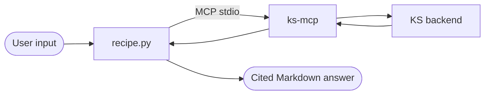

# Cookbook recipes

End-to-end, citation-grounded examples live in **[`ks-cookbook`](https://github.com/knowledgestack/ks-cookbook)**. Every recipe drives `ks-mcp` (real `[chunk:UUID]` citations, real tenant data) from a working agent.

## Browse

Full index: **[`recipes/INDEX.md`](https://github.com/knowledgestack/ks-cookbook/blob/main/recipes/INDEX.md)**.

A tour of what's there, organised by domain:

### Sales / RevOps / CS

| Recipe | Pain point |
| --- | --- |
| `icp_matcher` | Score a prospect against your ICP — A/B/C/DQ tier with cited criterion hits. |
| `account_research_brief` | AE pre-call prep: activity, objections, fit, next step. |
| `competitive_positioning` | Competitor → cited strengths / counters / traps. |
| `prospecting_email_personalizer` | Cold email with one cited personalization hook. |
| `outbound_call_prep` | Prospect + goal → cited 1-page discovery prep. |
| `stakeholder_map_drafter` | Account → cited stakeholder map (role, sentiment, gaps). |
| `deal_loss_retro` | Closed-lost deal → cited root causes + playbook gaps. |
| `churn_risk_flags` | Account → cited risk signals with severity. |
| `renewal_risk_evidence` | Cited evidence pack (value, adoption, risk, advocacy). |
| `qbr_deck_outline` | QBR slide-level outline with per-slide citations. |
| `rfp_question_router` | RFP line → team owner + cited draft answer. |

### Legal / Contracts / Privacy

| Recipe | Pain point |
| --- | --- |
| `nda_review` | NDA triage vs data-handling/retention policies. |
| `clause_extractor` | Key clauses pulled with cited spans. |
| `dpa_gap_check` | Data processing agreement gap analysis. |
| `data_subject_request_responder` | DSAR responder with cited record-keeping evidence. |
| `contract_renewal_checker` | Renewal checks against the latest playbook. |
| `court_docket_monitor` | Docket diff → cited summary of changes. |

### Healthcare

`adverse_event_narrative` · `audit_defensible_hcc_coder` · `discharge_summary_rewrite` · `drug_interaction_checker` · `clinical_trial_eligibility` · `chiro_visit_autopilot`

### Finance & risk

`basel_iii_risk_weight` · `aml_sar_narrative` · `cashflow_anomaly_detector` · `claim_adjudication_memo` · `expense_policy_violation`

### Engineering ops

`adr_drafter` · `changelog_from_commits` · `api_deprecation_notice` · `change_management_review` · `change_monitor_to_pr` · `api_doc_generator`

### Government / public sector

`citizen_intent_311` · `compliance_questionnaire` · `bcp_drill_plan`

(Plus more — the cookbook keeps growing. Check `recipes/INDEX.md` for the canonical list.)

## Anatomy of a recipe

Each `recipe.py` is ≤200 LOC and self-contained:

1. Spin up `ks-mcp` (stdio).
2. Use the framework of choice (mostly `pydantic-ai`) to bind `ks-mcp` tools to a domain prompt.
3. Run the agent, print the answer with citations, exit.

That makes them easy to copy-paste as the starting point for your own integration.

## Contributing a recipe

Built something on `ks-mcp` worth showing? **[Open a PR against `ks-cookbook`](https://github.com/knowledgestack/ks-cookbook/pulls)**:

1. Copy `recipes/_template/` into a new `recipes/<your_name>/`.
2. Keep the recipe ≤200 LOC; add a `README.md` with one paragraph of context.
3. Use real KS data (or a seed snapshot) — citations are the whole point.
4. Tag the PR with the domain (`sales`, `legal`, `healthcare`, …).

Featured recipes get linked from the cookbook front page.
