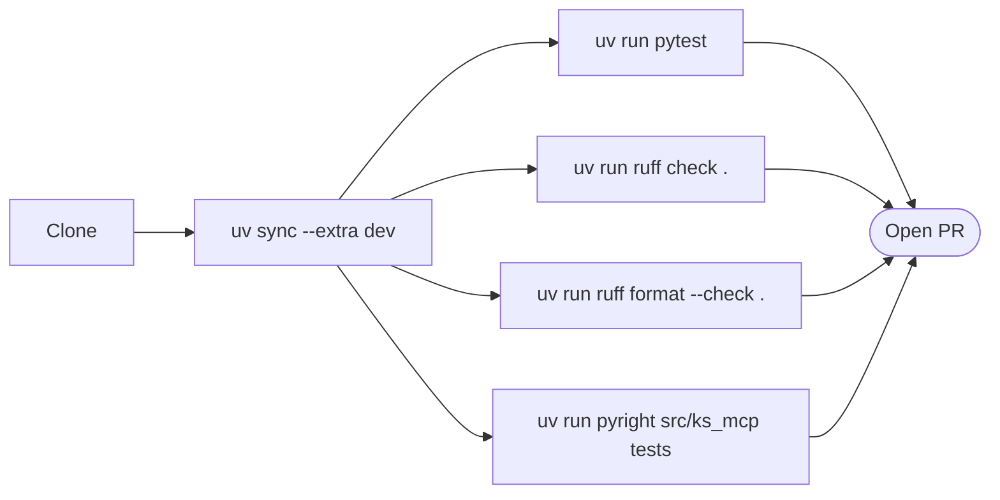

# Development

Local setup, test loop, and PR flow for contributors.

## Quick start

```bash
git clone https://github.com/knowledgestack/ks-mcp
cd ks-mcp
uv sync --extra dev
```



All four commands are required to be green before review.

## Repo layout

```
src/ks_mcp/
├── server.py         # FastMCP entrypoint + CLI
├── client.py         # ksapi client factory (KS_API_KEY / KS_BASE_URL)
├── schema.py         # pydantic IO models (ChunkHit, Citation, AskResult, …)
├── errors.py         # ksapi.ApiException → McpError
└── tools/
    ├── search.py     # search_knowledge, search_keyword
    ├── read.py       # read, read_around, view_chunk_image
    ├── cite.py       # cite (structured citation builder)
    ├── ask.py        # ask (one-shot agent Q&A over SSE)
    ├── browse.py     # list_contents, find, get_info
    ├── org.py        # get_organization_info, get_current_datetime
    └── provenance.py # trace_chunk_lineage, compare_versions

tests/
├── conftest.py
├── test_server.py    # registry + metadata
├── test_ask.py       # SSE parser + result builder
├── test_cite.py      # snippet, ancestry walk
├── test_search.py    # request shape + scored hit projection
├── test_read.py      # truncate + part-type normalization
├── test_schema.py    # round-trip of public models
├── test_client.py    # env handling
└── test_errors.py    # rest_to_mcp mapping

wiki/                  # source of truth for the GitHub wiki (these pages)
```

## Adding a new tool

```mermaid
flowchart TB
  A[Define IO models in schema.py] --> B[Create tools/your_tool.py]
  B --> C[register&#40;mcp&#41; with @mcp.tool&#40;&#41;]
  C --> D[Wire into server.py]
  D --> E[Add to EXPECTED_TOOLS in tests/test_server.py]
  E --> F[Write unit tests under tests/test_your_tool.py]
  F --> G[Update README + wiki/Tools.md]
  G --> H[Run all four green checks]
```



Conventions:

- Tool function name == MCP tool name. Keep it short and verb-shaped (`ask`, `cite`, not `do_ask`).
- Inputs use `Annotated[T, Field(description=...)]` — the description goes straight into the agent-facing schema.
- Return Pydantic models, not dicts. FastMCP infers the output schema automatically.
- Map `ksapi.ApiException` via `rest_to_mcp` — never let raw upstream errors leak.
- Document gotchas (e.g. `chunk_id` vs `path_part_id`) in the docstring; that's what frameworks surface.

## Running against a real backend

```bash
export KS_API_KEY="sk-user-..."
export KS_BASE_URL="https://api.knowledgestack.ai"     # or your staging URL
KS_LOG_LEVEL=DEBUG uvx --from . knowledgestack-mcp
```

Then attach the MCP inspector:

```bash
npx @modelcontextprotocol/inspector uvx --from . knowledgestack-mcp
```

## Test types

| Layer | What it covers | Where it lives |
| --- | --- | --- |
| Unit | helpers, parsers, schema | `tests/test_*.py` (no network) |
| Integration | tool registration, metadata, descriptions | `tests/test_server.py` |
| Smoke (manual) | live ks-backend round-trip | run inspector with real key |

Network is **never** hit by `pytest`. `respx` is available for hand-rolled HTTP fixtures if you add an integration suite.

## Git / PR flow

- `main` is always green. Open feature branches off `main`, name them `feat/...`, `fix/...`, `chore/...`, `docs/...`.
- Conventional commits: `feat(tools): ...`, `fix(read): ...`, `docs(wiki): ...`. CI status checks must pass before merge.
- Wiki source lives under `wiki/` in the main repo (so changes are reviewable in PRs). To republish here after editing:

  ```bash
  # one-time: clone the wiki repo next to the main repo
  git clone https://github.com/knowledgestack/ks-mcp.wiki.git ks-mcp.wiki

  # whenever wiki/ changes:
  cp ks-mcp/wiki/*.md ks-mcp.wiki/
  cd ks-mcp.wiki
  # don't push the source-folder doc itself
  rm -f README.md
  git add -A && git commit -m "docs(wiki): sync from main repo" && git push
  ```

  A future `.github/workflows/wiki-sync.yml` will automate this.

## Releasing

PyPI publish is automated by `.github/workflows/release.yml` on tagged commits (`v0.x.y`). After merge:

```bash
git checkout main
git pull
git tag v0.x.y
git push origin v0.x.y
```

The workflow builds, tests, and publishes; the `pypi` and `pyversions` README badges flip green once PyPI returns 200.
