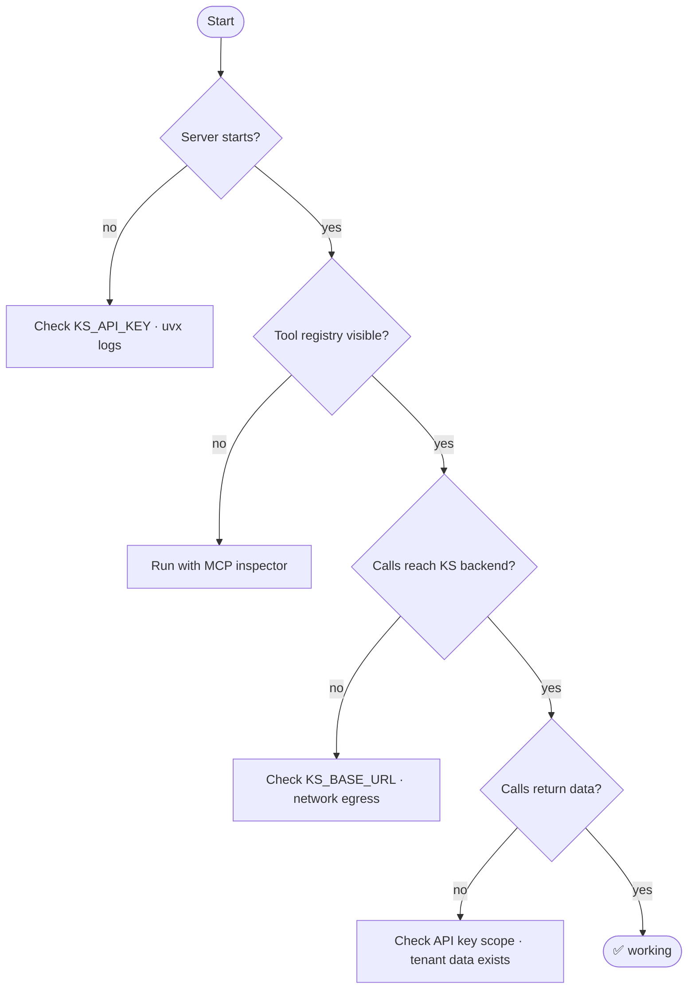

# Diagnostics

How to verify `ks-mcp` is wired up, see what tools are dispatching, and decode common errors.

## Verification flow



## MCP inspector

Click through every tool with a real key:

```bash
KS_API_KEY=sk-user-... \
  npx @modelcontextprotocol/inspector uvx knowledgestack-mcp
```

The inspector shows the full tool registry, lets you fire calls with arbitrary inputs, and dumps the responses — far faster than triaging through a downstream agent's tool palette.

## Debug logging

```bash
KS_LOG_LEVEL=DEBUG uvx knowledgestack-mcp
```

Prints tool I/O to **stderr** (safe for stdio clients — stdout is reserved for the MCP protocol). At `INFO`, only tool name + status + duration is logged.

## Smoke without a backend

The repo's test suite exercises imports + tool registration without hitting any network:

```bash
uv run pytest -q              # 50 tests, ~1s
uv run ruff check .
uv run pyright src/ks_mcp tests
```

Useful when you suspect a packaging / import / schema problem (rather than a backend issue).

## Error catalogue

Errors come from `ks_mcp.errors.rest_to_mcp` — every upstream `ksapi.ApiException` is mapped to a typed MCP error so the agent receives a usable message instead of a stack trace.

| HTTP | MCP error code | Likely cause | What to do |
| --- | --- | --- | --- |
| 401 | `INVALID_PARAMS` | `KS_API_KEY` missing / revoked / typo. | Re-issue from the dashboard, restart the server (cached client). |
| 402 | `INTERNAL_ERROR` | Per-key quota exhausted. | Stop looping; ask the user to upgrade or wait for quota reset. |
| 403 | `INVALID_PARAMS` | Path-based RBAC denied this read. | Pick a path the user can see; surface the body for context. |
| 404 | (returned as data) | Stale id / hallucinated UUID. | `read` retries chunk_id automatically; for others, fall back to `find` / `list_contents`. |
| 5xx | `INTERNAL_ERROR` | Upstream transient. | Do **not** auto-loop; surface to user. |

## Common gotchas

```mermaid
flowchart TB
  A[Empty document_name in search hits] --> A1["Old build pre-with_document fix.<br/>Pull main / re-deploy ks-mcp."]
  B[ask() hangs forever] --> B1["Backend's SSE keepalive blocked by your proxy.<br/>Lower idle timeout below 30s, or use stdio."]
  C[Tool not visible in client] --> C1["MCP clients load servers on launch.<br/>Restart the client after editing config."]
  D["page_number is None"] --> D1["Document is non-paginated (web page, plain text).<br/>Expected — graceful degrade."]
  E[Multiple 401s after rotating key] --> E1["ApiClient is cached per process.<br/>Restart ks-mcp."]
```

## Where to file issues

- Bugs / unexpected behaviour: [open an issue](https://github.com/knowledgestack/ks-mcp/issues/new?template=bug_report.yml).
- Feature requests: [feature template](https://github.com/knowledgestack/ks-mcp/issues/new?template=feature_request.yml).
- Vulnerabilities: see [Security](https://github.com/knowledgestack/ks-mcp/wiki/Security) — report privately, never in public issues.
