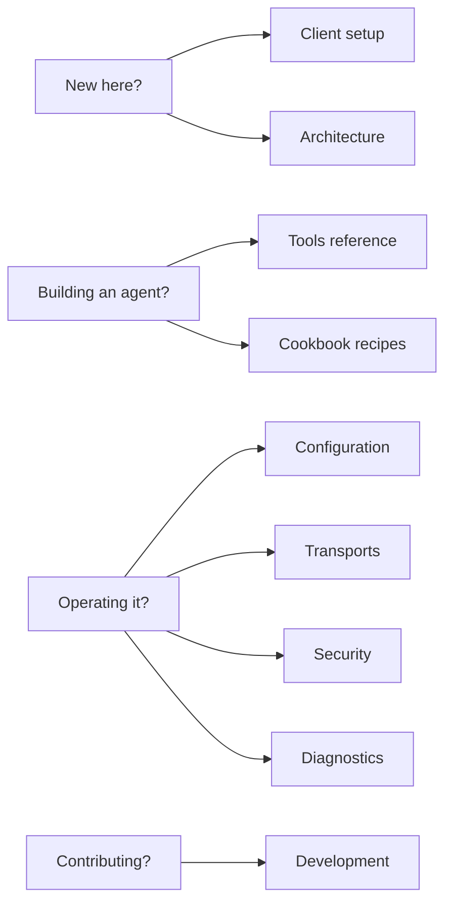

# Knowledge Stack MCP — Wiki

> **One MCP server. Every agent framework. Grounded answers in seconds.**

This wiki is the long-form companion to the repo's [README](https://github.com/knowledgestack/ks-mcp#readme). The README stays scannable; everything reference-y lives here.

## Where to start

## Pages

- **[Client setup](https://github.com/knowledgestack/ks-mcp/wiki/Client-Setup)** — Claude Desktop, Claude Code, Cursor, Windsurf, Zed, VS Code (Continue), pydantic-ai, LangGraph, CrewAI, OpenAI Agents SDK, Temporal.
- **[Architecture](https://github.com/knowledgestack/ks-mcp/wiki/Architecture)** — system diagram, dual paths to a grounded answer, identifier model, internals.
- **[Tools reference](https://github.com/knowledgestack/ks-mcp/wiki/Tools)** — every Phase 1 / 2 / 3 tool with inputs, outputs, and recommended pairings.
- **[Configuration](https://github.com/knowledgestack/ks-mcp/wiki/Configuration)** — environment variables, CLI flags, defaults.
- **[Transports](https://github.com/knowledgestack/ks-mcp/wiki/Transports)** — stdio vs Streamable HTTP, deployment patterns.
- **[Security model](https://github.com/knowledgestack/ks-mcp/wiki/Security)** — auth, tenant isolation, what is logged, vuln reporting.
- **[Diagnostics](https://github.com/knowledgestack/ks-mcp/wiki/Diagnostics)** — MCP inspector, debug logging, error catalogue.
- **[Development](https://github.com/knowledgestack/ks-mcp/wiki/Development)** — local setup, tests, contribution workflow.
- **[Cookbook recipes](https://github.com/knowledgestack/ks-mcp/wiki/Cookbook-Recipes)** — guided index of `ks-cookbook` examples by domain.

## External

- [GitHub repo](https://github.com/knowledgestack/ks-mcp) · [Issues](https://github.com/knowledgestack/ks-mcp/issues) · [Discord](https://discord.gg/McHmxUeS)
- [`ks-cookbook`](https://github.com/knowledgestack/ks-cookbook) — production-style agent recipes
- [`ks-docs`](https://github.com/knowledgestack/ks-docs) — central product docs (Mintlify → docs.knowledgestack.ai)
