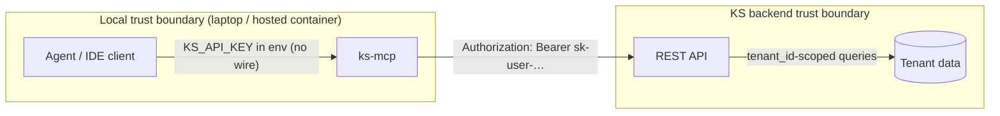
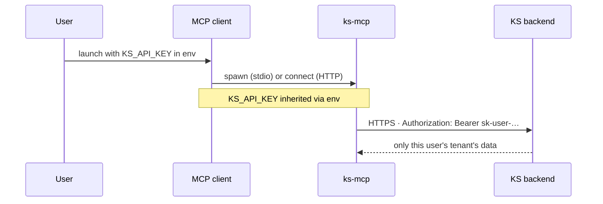
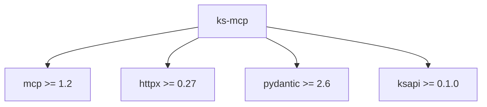

# Security model

`ks-mcp` is a **thin auth-pass-through**. Every guarantee here ultimately comes from the Knowledge Stack backend; this server adds typing, validation, and audit ergonomics.

## Trust boundaries

## Authentication

- One credential: a per-user API key (`sk-user-…`) issued from the KS dashboard.
- The key is passed to `ks-mcp` via the `KS_API_KEY` env var. **Never log it, never expose it over MCP.**
- On the wire, every upstream call carries `Authorization: Bearer <key>`. TLS is required (the default `KS_BASE_URL` is HTTPS).

## Tenant isolation

- Each `sk-user-…` key is scoped to **one tenant**. Cross-tenant access is rejected upstream.
- `ks-mcp` does not maintain a cross-tenant cache. The `ApiClient` is per process; each process holds exactly one key.
- For multi-tenant deployments, use **one process per tenant** (see [Configuration → tenant scoping](Configuration#tenant-scoping)).

## What is logged

| Level | What appears |
| --- | --- |
| `INFO` (default) | Tool name, request id, status code, duration. **No secrets, no full bodies.** |
| `DEBUG` | Truncated request/response bodies for tool I/O — to **stderr only**, never stdout (stdio safety). |

The `KS_API_KEY` is **never** logged at any level.

## Read-only-ish surface

- v1 is read-only **except** `ask`, which posts a user message to a thread and consumes the streaming response.
- There is no `ingest` / `delete` / `update` tool. Phase 3 will add admin-scoped writes behind an explicit `--allow-write` flag and a separate admin key.
- Schema validation runs on every tool call. Malformed responses from the upstream API surface as `INTERNAL_ERROR` rather than partially-typed payloads.

## Dependency surface

Pinned in [`pyproject.toml`](https://github.com/knowledgestack/ks-mcp/blob/main/pyproject.toml). CI runs `pytest`, `ruff`, and `pyright` on every PR.

## Vulnerability reports

Please report privately via [SECURITY.md](https://github.com/knowledgestack/ks-mcp/blob/main/SECURITY.md) — do **not** open a public issue for security bugs.
