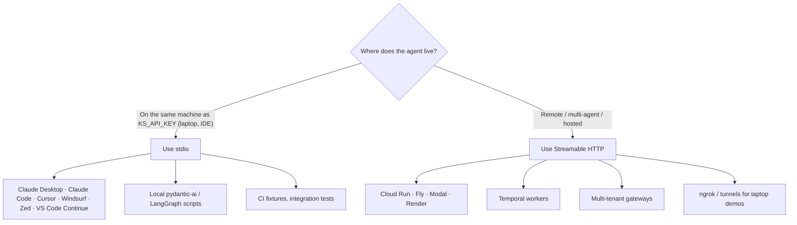
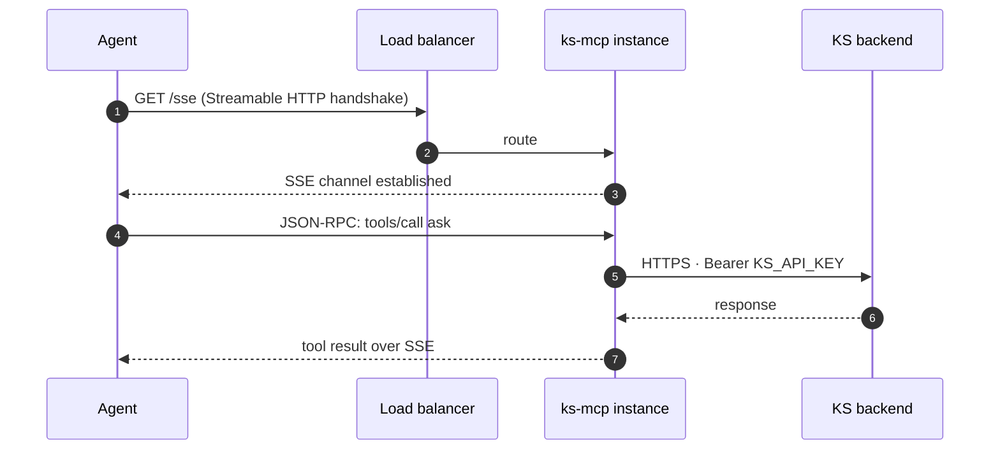

# Transports

`ks-mcp` speaks both MCP transports. Same tool surface either way; the choice is purely about *where* the agent runs.

## Decision tree



## stdio

```bash
uvx knowledgestack-mcp
```

The MCP client launches `ks-mcp` as a subprocess and pipes JSON-RPC over stdin/stdout. **No port, no auth dance, no TLS** — credentials are inherited via env vars from the parent process.

This is the right answer for desktop / IDE clients where:

- The user has their `KS_API_KEY` locally.
- You want zero deployment complexity.
- The agent and `ks-mcp` are in the same trust boundary.

## Streamable HTTP

```bash
uvx knowledgestack-mcp --http --host 0.0.0.0 --port 8765
```

The server exposes the MCP protocol over HTTP/SSE. The client connects via URL.



Right answer when:

- The agent runs on different infra than the user (Cloud Run, Fly, Modal, Temporal worker, hosted multi-tenant gateway).
- You want one centrally-managed `KS_API_KEY` instead of distributing it to N laptops.
- You're tunneling a local server through ngrok for a remote teammate.

## Deployment patterns

### Single-tenant, hosted

One `ks-mcp` per tenant, scoped to a long-lived `sk-user-…` key. Run as a stateless container; horizontal-scale behind a load balancer. Cache: stateless tool registration, so any instance can serve any request.

### Multi-tenant gateway (planned, v0.4)

A reverse proxy in front of one `ks-mcp` per `KS_API_KEY`. Picks the right backend by `Authorization` header on the incoming MCP connection. Tracked under the v0.4 roadmap milestone.

### Temporal worker

Long-running agent activities should attach via Streamable HTTP to a stable `ks-mcp` URL — don't spawn stdio subprocesses inside Temporal workers; the lifecycle mismatch will bite you.

## Performance / sizing

- Tool dispatch is I/O-bound; one process can comfortably hold hundreds of concurrent tool calls.
- The expensive thing is downstream — chunk search latency dominates. `ks-mcp` adds <5 ms of validation overhead per call.
- For SSE-heavy traffic (`ask`), give the load balancer at least the `KS_TIMEOUT_S` of read idle timeout (default 30s — bump if your agent answers run long).

## Troubleshooting

| Symptom | Likely cause |
| --- | --- |
| stdio client says "tool not found" | The client only loads servers on launch — restart it after editing config. |
| HTTP transport hangs | Load balancer eating SSE; lower idle keepalive or use long-poll mode. |
| Multiple calls return 401 | API key revoked / rotated; the cached `ApiClient` is per process — restart `ks-mcp`. |

See [Diagnostics](https://github.com/knowledgestack/ks-mcp/wiki/Diagnostics) for deeper debugging.
